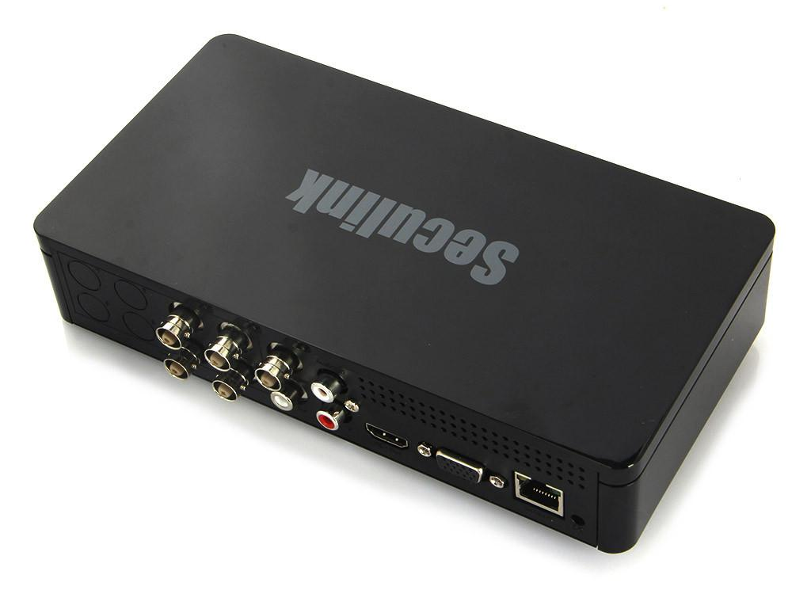

HiSilicon DVR hack
==================

> Report is under complete rewrite...

WARNING
-------

The web service of the DVR device has an exploitable buffer
overflow vulnerability. It can be exploited by unauthorized access.
This is extremely dangerous, the attacker can gain root shell
access on the device remotely. Although the device has ASLR protection,
exploiting another vulnerability it can be defeated. So
exploiting the buffer overflow is almost reliable.

Vendor has been notified for several months, but we did not get any response.

Details has been released on
[SecuriTeam Blog](https://blogs.securiteam.com/index.php/archives/3025).

Working PoC code can be found also [here](./pwn_hisilicon_dvr.py) in the repo.
(Do not use it for illegal purposes!)

If there are any questions, contact me here on github.
